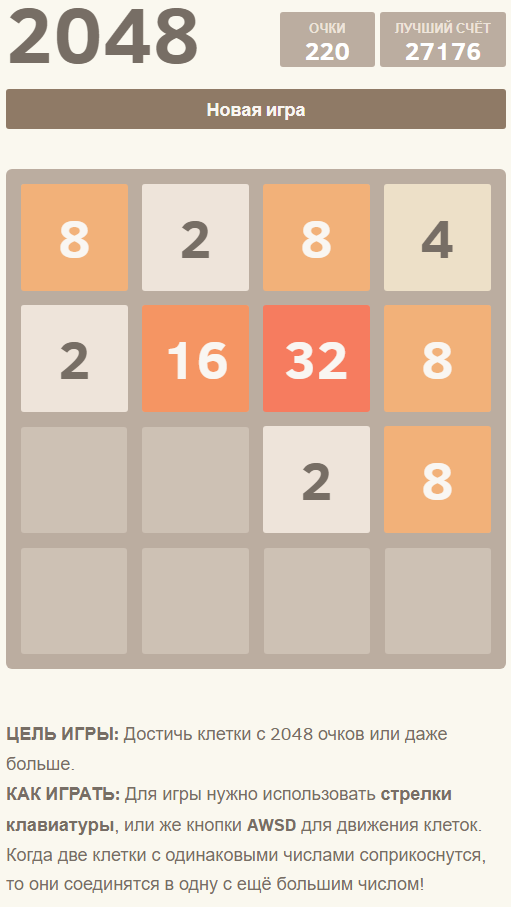

# 2048
Очередной клон игры 2048.

### Правила игры
Игровое поле состоит из сетки 4х4.
Игра начинается и на доске появляется две плитки со значением 2.
Передвигая, нужно сложить плитки одного «номинала». Двигать можно в 4 стороны.
Цель игры - это собрать на поле ячейку с цифрой 2048.

### Screenshot

  

